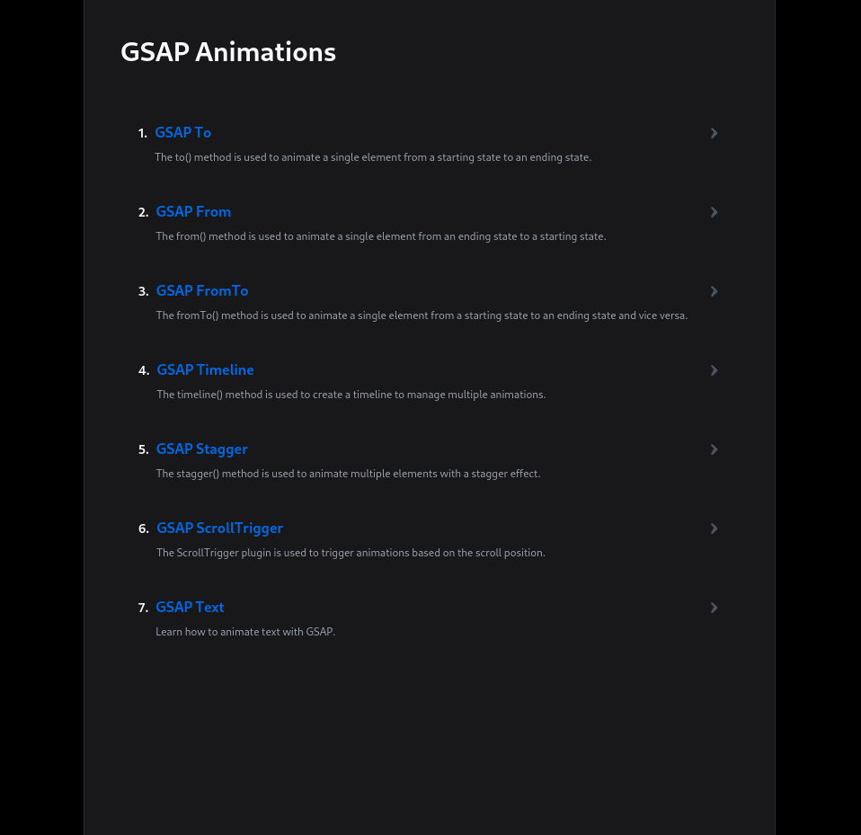

# web-motion-with-gsap

A sample project demonstrating how to create stunning web animations using GSAP (GreenSock Animation Platform) with Vue.js and TypeScript.

## Features

- **GSAP Integration**: Utilize the powerful GSAP library for smooth animations.
- **Vue.js Framework**: Built on top of Vue.js for reactive and efficient UI updates.
- **TypeScript Support**: Write safer and more maintainable code with TypeScript.
- **Responsive Design**: Implement animations that adapt seamlessly to different screen sizes.
- **Easy to Customize**: Modular structure allows for easy customization and expansion.

## Type Support for `.vue` Imports in TS

TypeScript cannot handle type information for `.vue` imports by default, so we replace the `tsc` CLI with `vue-tsc` for type checking. In editors, we need [Volar](https://marketplace.visualstudio.com/items?itemName=Vue.volar) to make the TypeScript language service aware of `.vue` types.

## Getting Started


To get a local copy up and running follow these simple steps.

### Prerequisites

Make sure you have Node.js and npm installed on your machine.

#### Installation

1. Clone the repo

   ```bash
   git clone https://github.com/yourusername/web-motion-with-gsap.git
   ```

2. Install npm packages
   ```bash
   npm install
   ```

#### Compile and Hot-Reload for Development

```sh
npm run dev
```

#### Type-Check, Compile and Minify for Production

```sh
npm run build
```
